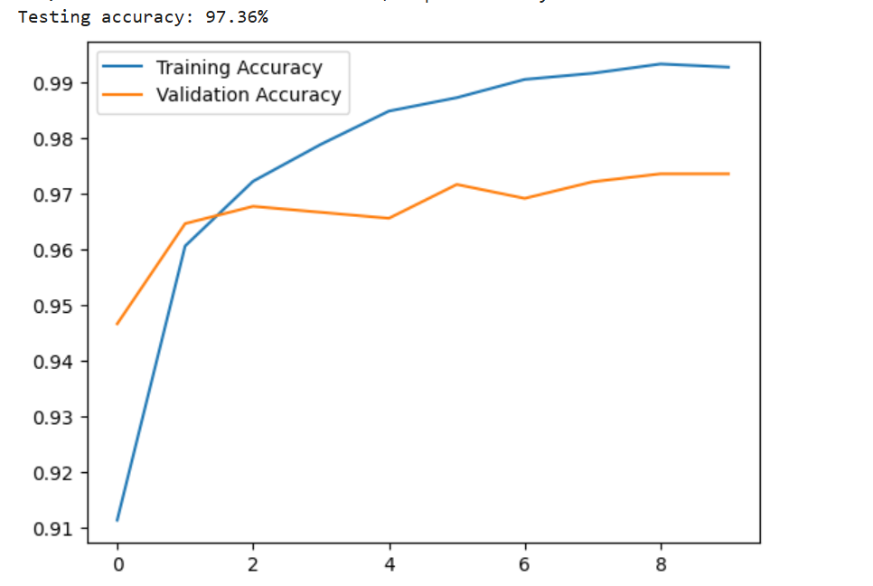
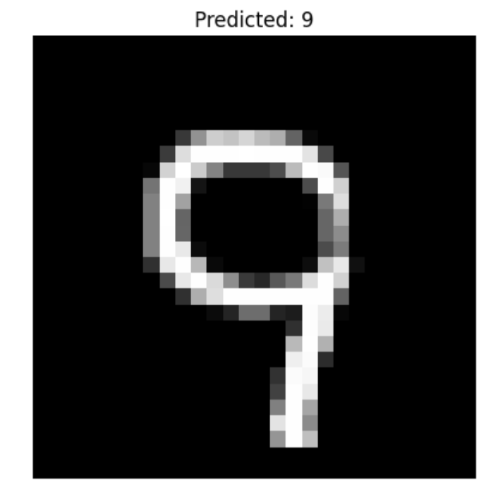

# Handwriting recognition using neural networks
## Project Description
This project trains an ANN(artificial neural network) on the MNIST dataset to recognize handwritten digits. 
The model contains:
1. A flatten layer that converts each 28x28 images into 784-element input vector
2. Two Dense layers with 128 and 64 neurons
3. A Dense output layer with 10 neurons (one for each 0-9 digit)

All hidden layers use the ReLU activation function.

## Project Overview
The goal of this project is to identify handwritten digits(0-9) from images or scanned documents using a simple feedforward neural network.

## Dataset
The MNIST dataset contains:
1. 70,000 grayscale images with each image being 28x28 pixels
2. 60,000 training images 
3. 10,000 testing images

## Model Architecture
A multi-layer feedforward ANN:
- **Input layer:** 784 neurons(flattened 28x28 image)
- **Hidden layer 1:** Dense(128), ReLU
- **Hidden layer 2:** Dense(64), ReLU
- **Output layer:** 10 neurons
  
**Activation function** used is ReLU because it's faster to train the network compared to when using sigmoid function.
  
## Technologies Used
1. NumPy for numerical computations
2. Pandas for data loading & data manipulation
3. Matplotlib for data visualizations like plotting graphs
4. Scikit-learn to split the data
5. Tensorflow, keras for building and training the model

## Open the project in Google Colab & run
[Click here to run the notebook](https://colab.research.google.com/drive/1T63uOuoW2dHmobu4z6CRXjbt-0ckeLmu?usp=sharing)

## Results
The model has achieved an accuracy of 97.36% on the validation set.

## Predictions
The model predicted 100% for the first five images from the testing dataset.
Here's an example:

## Authors 
Nadifa Abdigani - nadifaabdiganilab@gmail.com
